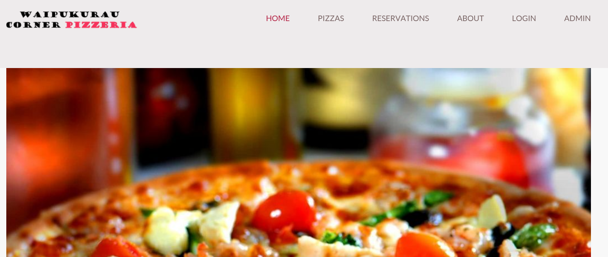

# Corner Pizzeria Web App

A PHP and MySQL web application for a pizza restaurant. The project provides a customer-facing site for browsing pizzas, placing orders, creating reservations, and managing login sessions, along with admin pages for maintaining products, customers, orders, and bookings.

## Features

- Customer registration and login
- Session-based access control
- Pizza menu browsing
- Online order placement
- Reservation booking
- Admin CRUD pages for:
  - food items
  - customers
  - orders
  - reservations
- AJAX customer search/autocomplete
- Responsive navigation for mobile devices
- Basic Selenium script for browser automation

## Tech Stack

- PHP
- MySQL
- HTML
- CSS
- JavaScript
- Selenium WebDriver

## Project Structure

- `index.php`: home page
- `product.php`: pizza menu showcase
- `order.php`: order creation page
- `place_order.php`: saves orders
- `reservation_page.php`: reservation form
- `reservation.php`: saves reservations
- `login.php` / `login_page.php`: authentication flow
- `listitems.php`, `listcustomers.php`, `listorders.php`, `listreservation.php`: admin and management pages
- `customersearch.php`: AJAX customer lookup
- `config.php`: database connection settings
- `checksession.php`: session and admin helper functions
- `css/`, `js/`, `images/`, `fonts/`: static assets
- `../selenium/`: optional browser automation script

## Setup

### 1. Prerequisites

Install a local PHP/MySQL environment such as:

- XAMPP
- WAMP
- MAMP
- LAMP

You need:

- PHP with `mysqli` enabled
- MySQL or MariaDB
- Apache or another PHP-capable web server

### 2. Place the project in your web root

This codebase contains hardcoded paths like `/pizza/` and `http://localhost/pizza/...`.

For the least friction, host the project as:

```text
http://localhost/pizza/
```

That usually means placing this folder in your web server root and naming the folder `pizza`.

Example on XAMPP:

```text
htdocs/pizza
```

### 3. Create the database

Create a MySQL database named:

```sql
pizza
```

The application expects these tables to exist:

- `customer`
- `fooditems`
- `orders`
- `orderlines`
- `booking`

If you already have a SQL schema from your coursework, import it into the `pizza` database.

If not, you will need to create the schema manually before the app can run.

### 4. Configure database credentials

Edit `config.php` and set the correct values for your local MySQL environment:

```php
define("DBUSER","your_username");
define("DBPASSWORD","your_password");
define("DBDATABASE","pizza");
define("DBHOSTNAME","127.0.0.1");
```

### 5. Create or seed users and menu data

To use the site properly, the database should contain:

- at least one customer account
- food items in `fooditems`

Important:

- The app treats the user with `customerID = 1` as the admin user.
- If you want admin access to the management pages, ensure your admin account has `customerID` set to `1`.

## Running the App

Start Apache and MySQL from your local stack, then open:

```text
http://localhost/pizza/index.php
```

You can then:

- browse the site from the home page
- register a new customer account
- log in
- place orders
- create reservations
- access admin pages if logged in as the admin user
